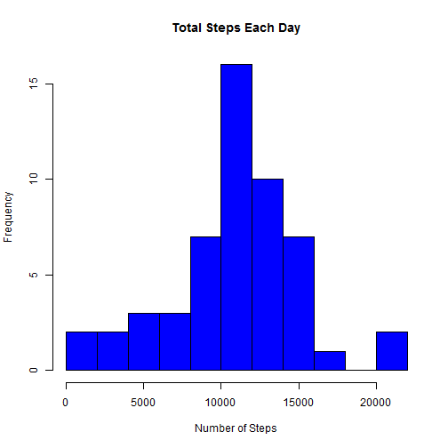
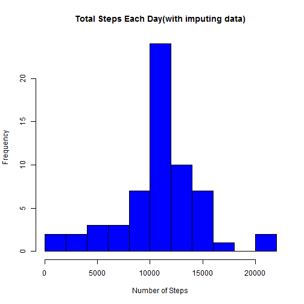
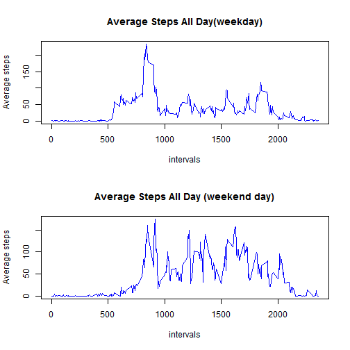

Introduction
---------------------------------------------

This is project 1 R Markdown document for **Reproducible Research ** for course in Coursera. 

This assignment makes use of data from a personal activity monitoring device. This device collects data at 5 minute intervals through out the day. The data consists of two months of data from an anonymous individual collected during the months of October and November, 2012 and include the number of steps taken in 5 minute intervals each day.


Data
---------------------------------------------

The data for this assignment can be downloaded from the course web site:

Dataset: Activity monitoring data [52K] (https://d396qusza40orc.cloudfront.net/repdata%2Fdata%2Factivity.zip)
The variables included in this dataset are:

1. steps: Number of steps taking in a 5-minute interval (missing values are coded as NA)

2. date: The date on which the measurement was taken in YYYY-MM-DD format

3. interval: Identifier for the 5-minute interval in which measurement was taken

The dataset is stored in a comma-separated-value (CSV) file and there are a total of 17,568 observations in this dataset.


Method
---------------------------------------------
###Lodaing and Preparing the data

1. Load the data (i.e. read.csv())


```r
raw<-read.csv("activity.csv")

good<-complete.cases(raw)

data<-raw[good,][,]
```

2. Process/transform the data (if necessary) into a format suitable for your analysis


```r
good<-complete.cases(data)

data<-data[good,][,]
```


###what is mean total number of steps taken per day?

1. Make a histogram of the total number of steps taken each day


```r
b<-tapply(data$steps, data$date,sum, na.rm=TRUE)
b<-b[!is.na(b)]

df <- data.frame(date=names(b),sum=b)
hist(b, main = paste("Total Steps Each Day"), col="blue", xlab="Number of Steps", breaks=10)
```

 

2. Calculate and report the mean and median total number of steps taken per day


```r
rmean <- mean(b)
rmedian<-median(b)
```

The mean is:


```r
rmean
```

```
## [1] 10766.19
```

The rmedian is:


```r
rmedian
```

```
## [1] 10765
```

###what is average daily activity pattern?

1. Make a time series plot (i.e. type = "l") of the 5-minute interval (x-axis) and the average number of steps taken, averaged across all days (y-axis)


```r
c<-tapply(data$steps, data$interval,mean, na.rm=TRUE)
c<-c[!is.na(c)]

df <- data.frame(interval=as.integer(names(c)),average=c)
plot(df$interval, df$average, main = paste("Average Steps all Day"), col="blue", xlab="intervals",ylab="Average steps", type="l")
```

 

2. Which 5-minute interval, on average across all the days in the dataset, contains the maximum number of steps?


```r
max<-max(df$average)

interval<-df$interval[which(df$average==max)]
```

The interval contains the maximum number of steps is:
  

```r
interval
```

```
## [1] 835
```

###Imputing missing values
1. Calculate and report the total number of missing values in the dataset (i.e. the total number of rows with NAs)


```r
sum(is.na(data))
```

```
## [1] 0
```

2. Devise a strategy for filling in all of the missing values in the dataset. The strategy does not need to be sophisticated. For example, you could use the mean/median for that day, or the mean for that 5-minute interval, etc.

I will use the mean for the intervals to replace the NA

3. Create a new dataset that is equal to the original dataset but with the missing data filled in.


```r
df<-raw

index<-is.na(df$steps)

avg <- tapply(data$steps, data$interval, mean, na.rm=TRUE, simplify=T)

df$steps[index] <- avg[as.character(df$interval[index])]
```


4. Make a histogram of the total number of steps taken each day and Calculate and report the mean and median total number of steps taken per day. Do these values differ from the estimates from the first part of the assignment? What is the impact of imputing missing data on the estimates of the total daily number of steps?


```r
f<-tapply(df$steps, df$date,sum, na.rm=TRUE)

hist(f, main = paste("Total Steps Each Day(with imputing data)"), col="blue", xlab="Number of Steps", breaks=10)
```

 

```r
rmean <- mean(f)

rmedian<-median(f)
```

The mean for the imputed dataset is:


```r
rmean
```

```
## [1] 10766.19
```

The median for the imputed dataset is:


```r
rmedian
```

```
## [1] 10766.19
```


###Are there differences in activity patterns between weekdays and weekends?


1. Create a new factor variable in the dataset with two levels - "weekday" and "weekend" indicating whether a given date is a weekday or weekend day.


```r
df<-data
df$day=weekdays(as.Date(df$date))
df_wkday =subset(df, ! day %in% c("Saturday","Sunday"))
df_wkend =subset(df,  day %in% c("Saturday","Sunday"))
```

2. Make a panel plot containing a time series plot (i.e. type = "l") of the 5-minute interval (x-axis) and the average number of steps taken, averaged across all weekday days or weekend days (y-axis). 


```r
par(mfrow=c(2,1))
d<-tapply(df_wkday $steps, df_wkday $interval,mean, na.rm=TRUE)
df <- data.frame(interval=as.integer(names(d)),average=d)
plot(df$interval, df$average, main = paste("Average Steps All Day(weekday)"), col="blue", xlab="intervals",ylab="Average steps", type="l")

e<-tapply(df_wkend $steps, df_wkend $interval,mean, na.rm=TRUE)
df <- data.frame(interval=as.integer(names(e)),average=e)
plot(df$interval, df$average, main = paste("Average Steps All Day (weekend day)"), col="blue", xlab="intervals",ylab="Average steps", type="l")
```

 


